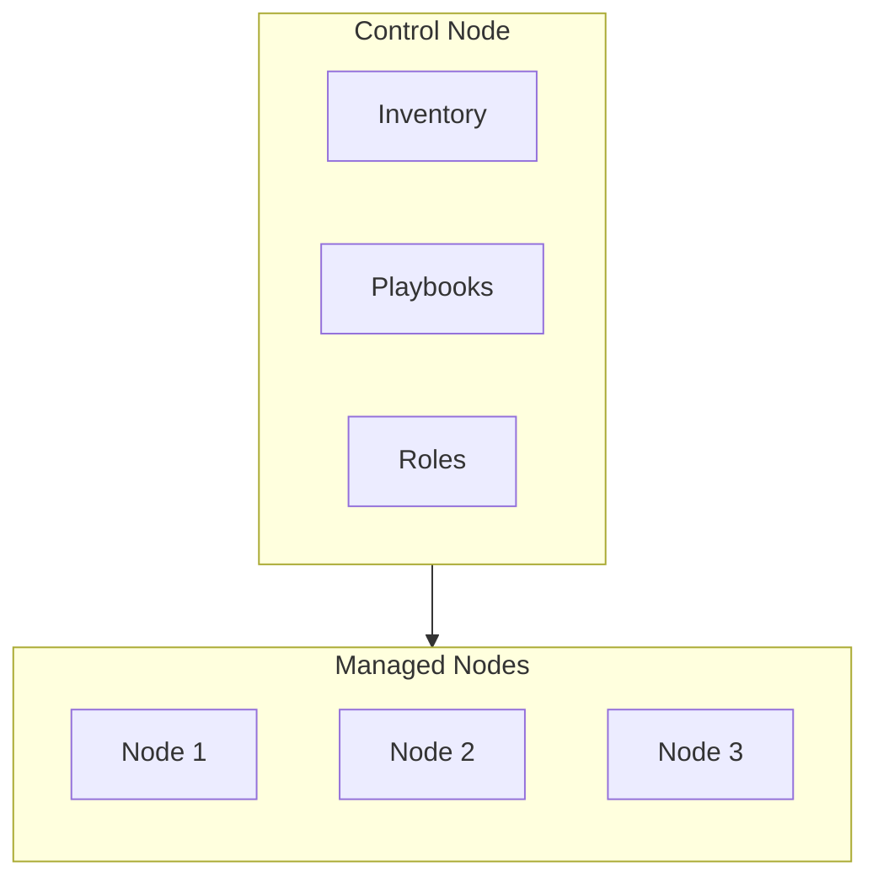

<Note>
  Official reference:
  - [Getting started with Ansible](https://docs.ansible.com/projects/ansible/latest/getting_started/index.html)
  - [Architecture overview](https://docs.ansible.com/projects/ansible/latest/dev_guide/overview_architecture.html)
</Note>

Ansible uses a simple two-tier architecture: a **control node** that you operate from, and **managed nodes** that Ansible configures over SSH.

## Control node

The control node is the machine you run Ansible from. It is responsible for:

- Reading the **inventory** to know which servers to target
- Executing **playbooks** that describe the tasks to apply
- Applying **roles** that bundle related playbooks together

<CardGroup cols={3}>
  <Card title="Inventory" icon="list">
    The list of managed nodes (servers) that Ansible will target. You can group servers and assign variables per group.
  </Card>
  <Card title="Playbooks" icon="book">
    YAML files that define the tasks (instructions) to be applied to the managed nodes in order.
  </Card>
  <Card title="Roles" icon="folder">
    Collections of playbooks and related files that are organised for reuse and sharing across projects.
  </Card>
</CardGroup>

## Managed nodes

Managed nodes are the servers controlled by the control node. They do **not** require any Ansible software — Ansible connects to them over **SSH** and executes tasks directly.

<Warning>
  Ansible requires Python to be installed on each managed node so that its modules can execute remotely.
</Warning>

## How it fits together

<Steps>
  <Step title="Define your inventory">
    List the servers you want to manage, either as a static file or a dynamic inventory source.
  </Step>
  <Step title="Write a playbook">
    Describe the desired state of your servers using YAML tasks. Group related tasks into roles for reuse.
  </Step>
  <Step title="Run the playbook">
    Execute `ansible-playbook playbook.yml` from the control node. Ansible connects to each managed node via SSH and applies the tasks.
  </Step>
</Steps>
